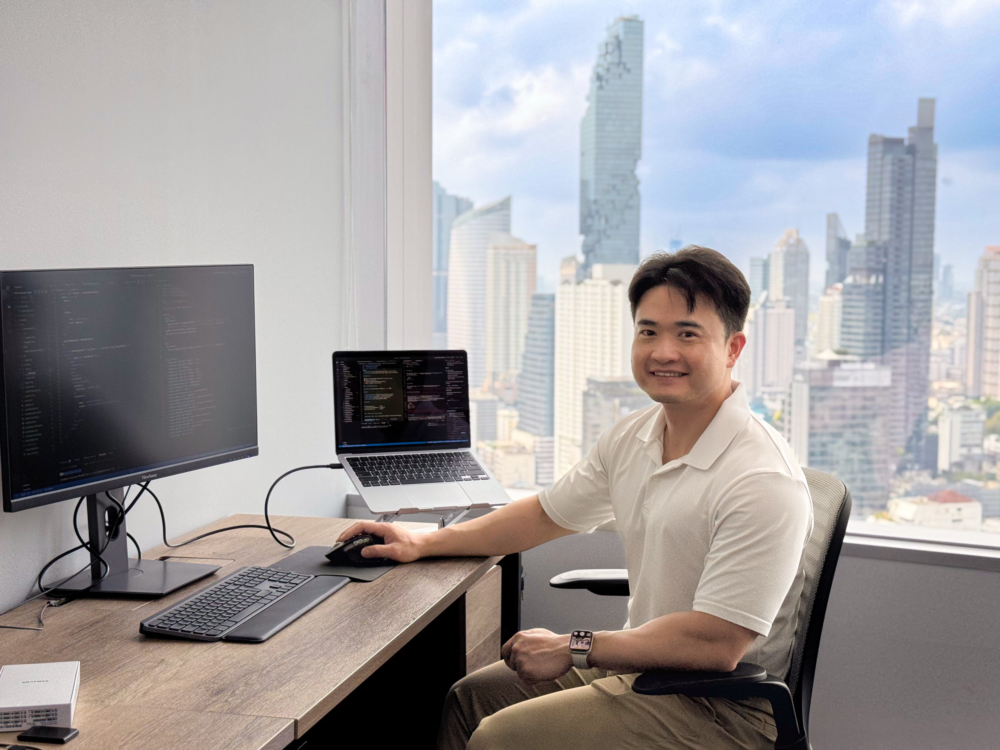

# Hi, I'm Keeratipong (Chee) 👋 😄 ผมชื่อฉี

I'm a **Frontend Developer** based in Bangkok, Thailand, specializing in **AI agentic workflows** and **full product ownership**. I am fluent in Thai 🇹🇭, English 🇺🇸, and Chinese 🇨🇳. 

Backed by over 12 years of entrepreneurial leadership, I bring a strong sense of ownership to software engineering. Recently, I worked as a Solo Full-Stack Developer at Makers Digital, where I independently architected and delivered a production-ready recruitment platform using **TanStack Start** and **Strapi v5** within just 30 days.

I focus on combining modern frontend architectures with structured AI workflows to accelerate development cycles while maintaining production-level code quality.

## 🤖 AI Agentic Development (My Moat)
I don't just use AI to write code; I orchestrate it using a structured **7-step workflow** (Context → Plan → Execute → Verify → Debug → Close-out → Human Review). I build modular documentation systems (`REQUIREMENTS.md`, `SYSTEM_DESIGN.md`, `RULES.md`, `DECISIONS.md`) to constrain AI behavior, reduce ambiguity, and ensure architectural governance.

## 🛠 Tech Stack

### Languages  

### Frameworks & Libraries  

 

 

### Backend & CMS  

### Tools & Environments

## 💼 Recent Professional Experience

### Novasou — Internal Recruitment Platform
*Solo Full-Stack Developer* | `TanStack Start`, `React 19`, `Strapi v5`, `Tailwind v4`
- Architected a SSR frontend with type-safe routing and programmatic SEO.
- Engineered a full Strapi v5 backend with a dynamic page generator and idempotent TypeScript seed pipelines.
- *(Private repository — Local demo available on request)*

### B2B E-Commerce Platform
*Frontend Developer* | `TanStack Start`, `Strapi v5`
- Proposed and executed a "Backend-First" architectural pivot, decoupling frontend progress from unstable UI requirements.
- Shipped Layout/Global Config and built a dynamic page builder utilizing Strapi Dynamic Zones.
- *(Private repository)*

## 📂 Personal & Learning Projects

### 1. [The Wild Oasis (for admin panel)](https://wild-oasis-for-employee.vercel.app/)
An internal application for hotel staff to manage bookings, cabins, and guests.
- **Login**: `test@test.com` | `12345`
- **Technologies**: `React`, `Vite`, `React Query`, `Styled Components`, `Supabase`
- [View Code](https://github.com/keeratipong4/17-the-wild-oasis.git)

### 2. [Wild Oasis Hotel (for Guests)](https://wild-oasis-home-stay.vercel.app/)
A website for customers to make reservations.
- **Technologies**: `Next.js`, `React`, `Tailwind CSS`, `Supabase`
- [View Code](https://github.com/keeratipong4/21-the-wild-oasis-website.git)

### 3. [Fast React Pizza Company](https://16-fast-react-pizza-seven.vercel.app/)
An application for ordering pizza. Users can order, edit, and search for orders.
- **Technologies**: `React`, `Redux`, `Tailwind CSS`, `Vite`
- [View Code](https://github.com/keeratipong4/16-fast-react-pizza.git) | [YouTube Explanation](https://youtu.be/yF-5O3hOREQ)

## 👤 Personality & Hobbies
Besides honing my coding skills, I dedicate myself to weight training five days a week, a routine I've maintained for over 11 years. I also enjoy making videos to share my journey on social media.

## 📄 Resume
You can download my resume directly from my [website](https://www.keeratipong.com/).

## 📫 Contact & Social Accounts
- 
-  [`linkedin.com/in/keeratipong4`](https://www.linkedin.com/in/keeratipong4)
- 
-   [`youtube.com/keeratipong`](https://youtube.com/keeratipong)
-  [`facebook.com/cheeblackblue`](https://www.facebook.com/cheeblackblue)
-  [`instagram.com/nai_chee`](https://www.instagram.com/nai_chee/)

<!---
keeratipong4/keeratipong4 is a ✨ special ✨ repository because its `README.md` (this file) appears on your GitHub profile.
--->
